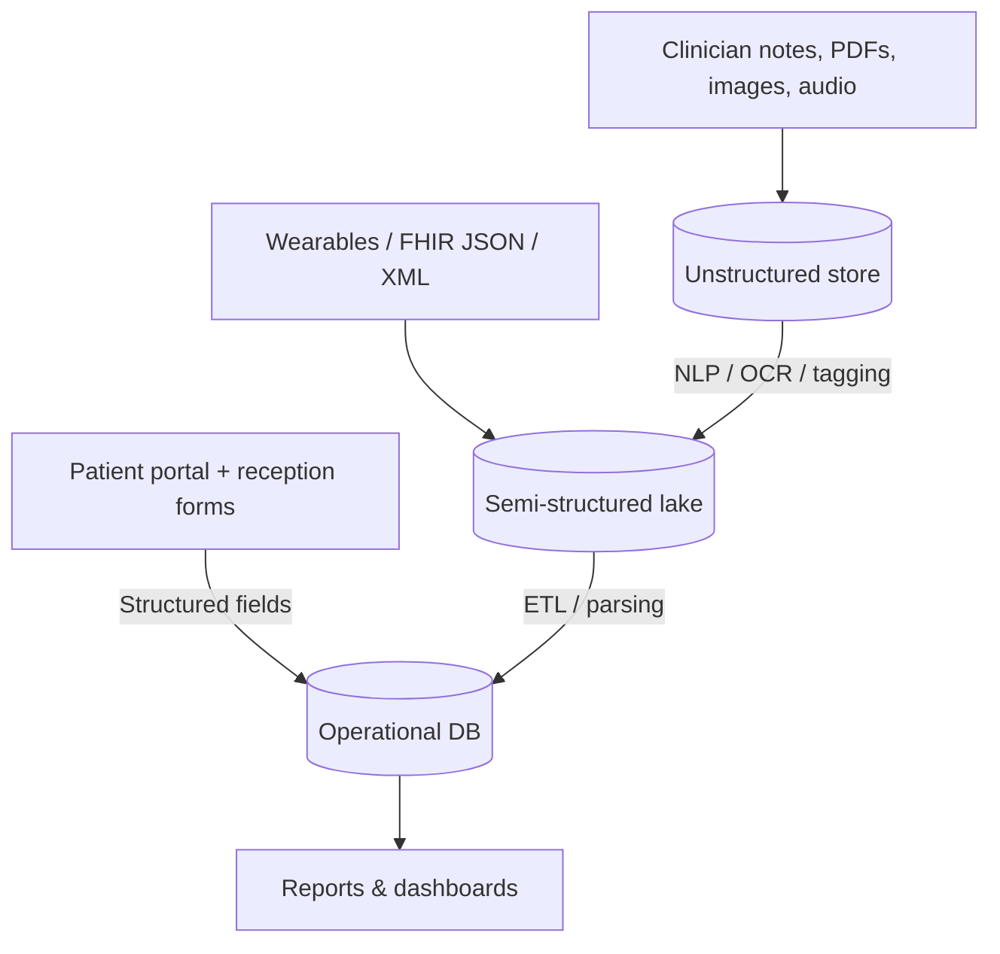

## Activity 02 — Data Types in a Physiotherapy Clinic System

This scenario models the clinic described in the project (`patients`, `physiotherapists`, `appointments`).

### Examples table

| Data Type       | Example in Your Scenario                                                                                                                                                                                                                                       |
| --------------- | -------------------------------------------------------------------------------------------------------------------------------------------------------------------------------------------------------------------------------------------------------------- |
| structured      | Tables/collections for `patients` (id, name, preferred_physio), `physiotherapists` (id, name, specialization), and `appointments` (id, patient_id, physiotherapist_id, appointment_date, duration_minutes, status).                                            |
| unstructured    | Free-text clinical notes in appointments, PDF referrals from GPs, scanned consent forms, X‑ray images, email bodies, and voice memos recorded by clinicians.                                                                                                   |
| semi-structured | JSON or XML device data from wearables (time-series HR/steps), HL7 FHIR resources, appointment confirmation emails with consistent fields (subject, datetime, patient), and web form submissions that include both fixed fields and an open-ended description. |

### How each type is used

- **Structured**: Powers day‑to‑day operations—booking, conflict checks, billing, audit trails, and analytics (e.g., number of scheduled vs completed sessions). It maps directly to defined schemas and foreign keys.
- **Unstructured**: Captures rich clinical context (symptoms, assessments, images, audio). Critical for clinician decision‑making but not readily queryable without extra processing.
- **Semi-structured**: Provides machine‑readable keys with flexible content (e.g., JSON FHIR). Easier to ingest and transform into the clinic’s relational model while preserving variability.

### Visual representation (high level)

### Questions

- **What challenges might arise when storing or processing unstructured data?**

  - Hard to search/query without metadata; requires NLP/OCR and indexing.
  - Inconsistent formats and quality; large storage requirements (images/audio).
  - Privacy and compliance (PHI) across multiple stores and pipelines.
  - Versioning and provenance of derived annotations.

- **How can semi-structured data bridge the gap?**

  - Key–value tags and schemas (JSON/XML/FHIR) provide predictable anchors for parsing while allowing optional fields.
  - Simplifies ingestion, validation, and schema evolution; supports partial mapping into relational tables.
  - Enables incremental enrichment: store raw payload + normalized extracts for analytics.

- **Which type is most important in this scenario, and why?**
  - **Structured data** is most important operationally: it enables scheduling, preventing double‑booking, billing, reporting, and interoperability via stable identifiers and relations. Unstructured and semi‑structured add valuable clinical depth, but operations depend on the structured core.
